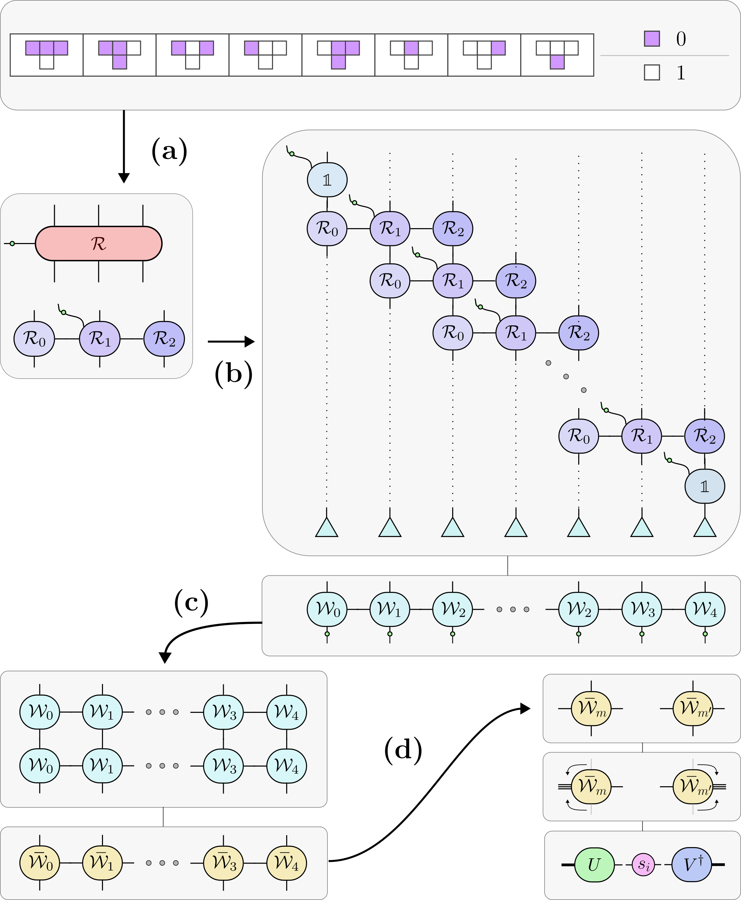

# `catnip🐈🐈‍⬛`: Cellular Automata Tensor Networks in NumPy

Welcome to `catnip🐈🐈‍⬛`! This project provides NumPy-based code for exploring cellular automata with tensor networks. It is designed to be a playground for studying discrete complex systems like cellular automata, and to compute quantum information based measures like the entanglement entropy for these classical dynamical systems. The origin of the project was the question: "How can we use quantum-tools like tensor networks to study discrete dynamical systems?"

This codebase was originally developed for my MSc thesis at the University of Amsterdam, titled "Measuring the complexity of cellular automata with tensor networks" (2023). Based on that work a paper was written together with [Wout Merbis](https://github.com/wmerbis/), which can be found here: **[Operator Entanglement Growth Quantifies Complexity of Cellular Automata](https://doi.org/10.1007/978-3-031-63749-0_3)**


## Key Features

- **Elementary Cellular Automata (ECA) MPOs**: Implements matrix-product operator (MPO) representations of the 256 elementary cellular automata, allowing to model the time-evolution with tensor networks.
- **Tensor Network Operations**: A set of tensor network operations, including contractions, conversions between tensor and vector representations, and bond-dimension optimizations with SVDs.
- **Demonstrative Notebooks**: Jupyter notebooks that allow for visualization of ECA time-evolution and to test operations for random vectors, matrices, and tensor networks.
- **Unit Tests**: A set of tests to ensure the correctness of the ECA implementations and tensor network manipulations, taking into account the numerical precision.

## Installation

To get started, clone the repository and install the necessary dependencies.

```bash
git clone https://github.com/calvinbakker/catnip.git
cd catnip
pip install . 
```

## Usage

The `notebooks/` directory contains examples of how to use the package. The best place to start is `notebooks/eca-evolve.ipynb` to see how an ECA evolves over time.

## Project Structure
```
catnip/
├── src/catnip/                 # Main package
│   ├── __init__.py             
│   ├── config.py               # Configuration of the package
│   ├── random.py               # Randomization utilities
│   ├── util.py                 # Utility functions
│   │  
│   ├── imp/                    # Implementations
│   │   ├── __init__.py
│   │   └── eca.py              # Elementary Cellular Automata (ECA) implementation
│   │
│   └── ops/                    # Operations
│       ├── __init__.py
│       ├── contract.py         # Tensor contractions
│       ├── convert.py          # Mapping between tensor-space and vector-space
│       ├── measure.py          # Measurement of observables
│       ├── opt_mpo.py          # Matrix Product Operator optimization
│       └── opt_mps.py          # Matrix Product State optimization
│
├── tests/                      # Unit tests
│   ├── test_eca.py             # Tests for correctness of the ECA implementation
│   └── test_ops.py             # Tests for correctness of tensor network operations
│
└── notebooks/                  # Jupyter notebooks
    ├── eca-evolve.ipynb        # ECA evolution visualization
    └── ops-tests.ipynb         # Operation testing on random objects

```

## ECA to MPO Construction

The following image illustrates the procedure for constructing a tensor network operator (MPO) for an elementary cellular automaton.



## Conventions

The tensor operations in this project follow a specific set of index conventions to ensure consistency. For a detailed explanation, please see the [conventions.md](conventions.md) file. A how-to guide for manipulating indices is also included in this file. 

## Running Tests

To verify that everything is working as expected, you can run the unit tests from the root directory:

```bash
python -m unittest discover tests/ -v
```

## Future Improvements

This project is fully tested and functional in its current form, but here are some low hanging fruit 🍒 to expand upon:

- **Expanded Tensor Network Support**: Currently, the code focuses _only_ on the Matrix Product State (MPS) and Matrix Product Operator (MPO) ansatz. It could be extended to support other tensor network ansatzes like PEPS and MERA. The `conventions.md` file provides a solid foundation for anyone looking to tackle this.
- **Performance Benchmarking**: The current implementation has not been benchmarked against other tensor network libraries/implementations. It would be interesting to explore more performant backends, such as using `np.einsum` for contractions in `NumPy`, to see how it compares to the tensordot-reshape-transpose procedure which is used extensively.

## Contributing

Contributions are welcome! If you have ideas for new features, improvements, or bug fixes, feel free to open an issue or submit a pull request.

## License

This project is licensed under the MIT License. See the [LICENSE.txt](LICENSE.txt) file for details.
